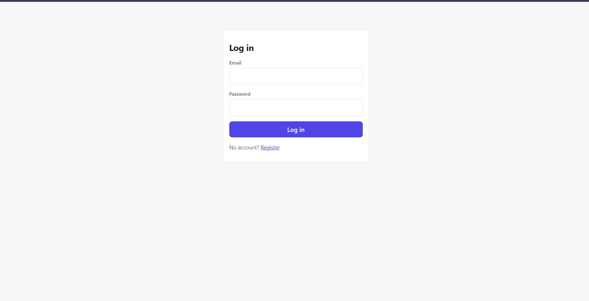
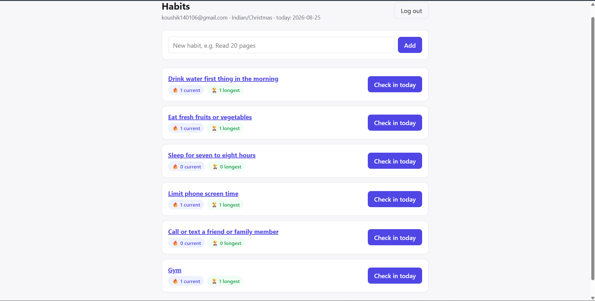
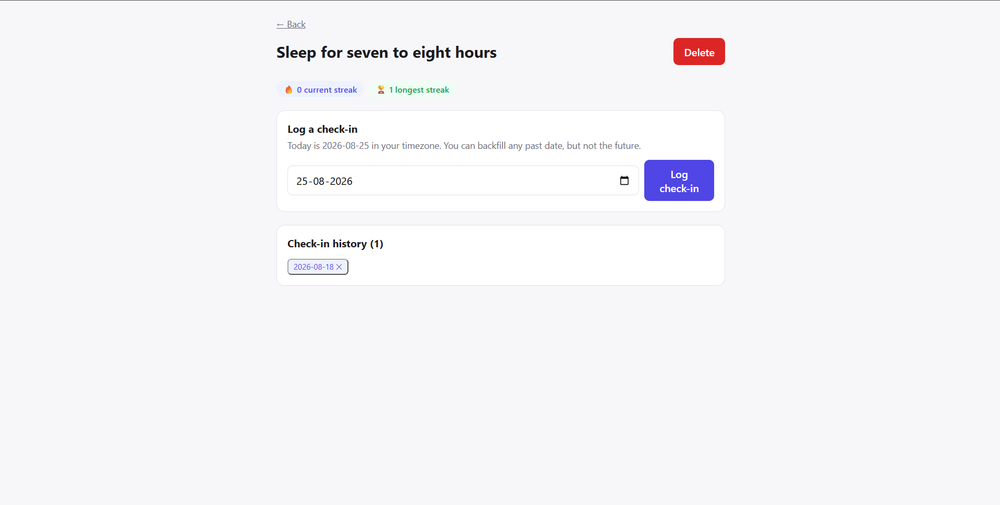

# Walkthrough — Habit Tracker with Streaks

**Author:** Koushik
**Assignment:** Product Engineering Intern — Full Stack, Burdenoff
**Stack:** React + TypeScript (Vite) · Node/Express + TypeScript · PostgreSQL via Prisma

This is a written walkthrough of my implementation and key decisions, submitted
in place of a video per the assignment instructions ("This can be a Loom video
or a short written walkthrough").

---

## 1. What the app does

Users register with an email, password, and their **IANA timezone** (e.g.
`Asia/Kolkata`). They create habits, check in daily — either for today or by
backfilling a past date — and see current and longest streaks computed
strictly against their **local calendar day**, not UTC time or elapsed hours.



Once logged in, the dashboard lists all habits with live current/longest
streak badges, and lets you add a new habit or check in with one click.



---

## 2. The core problem: local-day logic

The hard part of this assignment isn't CRUD — it's that **a streak is defined
in terms of the user's calendar day, not elapsed time or UTC**. If a user in
`Asia/Kolkata` checks in at 11:58 PM and again at 12:05 AM the next day,
that's two different local days only 7 minutes apart — and it should count as
two consecutive days, not zero. Someone in `America/Los_Angeles` and someone
in `Asia/Tokyo` checking in at "the same UTC instant" may be on entirely
different local dates.

**Where this lives:** `backend/src/services/timezone.service.ts`. This is the
**only** file in the codebase allowed to ask "what day is it for this user."
Specifically:

- `todayInTimezone(tz)` — resolves "today" for a given IANA timezone using
  Luxon (`DateTime.now().setZone(tz).toISODate()`).
- `isFutureLocalDate(date, tz)` — used to reject future-dated check-ins.
- `isValidTimezone(tz)` — validates the timezone string at registration by
  asking Luxon if it can construct a valid `DateTime` in that zone, rather
  than maintaining a hardcoded list of valid IANA zones.
- `addDays` / `diffInDays` — small helpers so calendar-day arithmetic never
  gets done ad hoc elsewhere with raw `Date` math (a common source of
  off-by-one/DST bugs).

Every controller that needs "today" imports from this module. I never call
`new Date()` to derive a user-facing day anywhere else in the backend.

---

## 3. Why `localDate` is a string, not a timestamp

The `CheckIn.localDate` column is a plain `YYYY-MM-DD` string, not a
`DateTime`/timestamp column. This was deliberate:

- The local day is resolved **once**, at write time — either "now" via
  `todayInTimezone`, or an explicit backfill date the user picked. Once
  resolved it's just a fact ("this habit was done on this calendar day"), and
  storing it as a timestamp would reintroduce the exact ambiguity we're
  avoiding — a timestamp needs a timezone to be turned back into a "day," and
  now the DB/ORM would be doing that conversion instead of the isolated
  service.
- ISO date strings sort and compare correctly with plain string operators
  (`<`, `>`, `===`), which is what both the future-date check and the streak
  calculation rely on.
- It maps directly onto the constraint I actually want: "one check-in per
  habit per local day," expressed in `prisma/schema.prisma` as
  `@@unique([habitId, localDate])`. The **database** enforces this, not just
  app code — a race condition or upstream bug can't create a duplicate.



The screenshot above shows the date picker (capped at today), the "Log
check-in" form, and the check-in history rendered as deletable date chips —
each one is a raw `localDate` value pulled straight from the database.

---

## 4. Streak calculation

`backend/src/services/streak.service.ts` takes a list of `localDate` strings
for a habit plus "today" (already resolved via the timezone service) and
returns `{ currentStreak, longestStreak }`. It knows nothing about
timezones — it's pure date-string arithmetic, which makes it trivial to unit
test in isolation (`backend/scripts/test-core-logic.ts`, runnable via
`npm run test:core`, no database required).

Two decisions worth flagging:

- **Longest streak** = the longest run of consecutive calendar days ever
  logged, full stop.
- **Current streak** has a one-day grace period: if the most recent check-in
  was *yesterday* (not today), the streak is still reported as alive rather
  than reset to zero. A user who checked in yesterday and simply hasn't
  checked in yet today (say it's 9 AM) shouldn't watch their streak visually
  die before they've had a chance to act. The streak only actually breaks
  once a full local day is skipped with no check-in.

I tested this against: empty history, a run ending today, a run ending
yesterday (still alive), a stale run broken 2+ days ago (current resets to 0,
longest preserved), a gap in the middle of the history (longest picks the
bigger run, current reflects only the trailing run), and defensive handling
of duplicate/unsorted input even though the DB constraint should make
duplicates impossible in practice. All 15 cases pass.

---

## 5. Validation & error handling

- Request bodies are validated with `zod` schemas
  (`backend/src/validators/schemas.ts`) — invalid email, short passwords,
  invalid IANA timezone strings, and malformed dates are rejected before
  they reach a controller.
- A centralized error handler (`middleware/errorHandler.ts`) maps: `zod`
  validation errors → 400 with per-field details; a custom `AppError` →
  whatever status/code it was thrown with (401 bad credentials, 404 a habit
  that isn't yours, 409 duplicate check-in/email); Prisma's `P2002`
  unique-violation code → 409 as a fallback safety net; everything else → 500,
  logged server-side, generic message to the client.
- Ownership checks: every habit/check-in route verifies the resource belongs
  to the authenticated user before reading or mutating it, so one user can't
  touch another user's habits by guessing IDs.
- I manually verified both the duplicate-check-in and future-date rejections
  work end-to-end: attempting to log the same local day twice on a habit
  returns a 409 with a clear message, and attempting a future date is
  rejected server-side regardless of what the client sends.

---

## 6. Auth

Email + password + IANA timezone at registration. Passwords are hashed with
bcrypt (12 rounds). Login returns a JWT containing `userId` and `timezone` —
embedding the timezone in the token means every authenticated request already
knows which zone to resolve "today" against, no extra DB round-trip needed.
For a take-home of this scope I used `localStorage` for the token on the
frontend; in a production system I'd move to an httpOnly cookie to reduce XSS
exposure, but that adds CSRF-protection surface area that felt out of scope
here.

---

## 7. What I deliberately left out

Per the assignment's "don't over-engineer" note, I skipped: refresh tokens,
email verification, habit editing (only create/delete), a full calendar-grid
visualization (the detail page uses a simple list of date chips instead —
enough to see history and delete a mistaken entry without building a full
calendar component), and pagination (not needed at a habit-tracker's typical
check-in volumes).

---

## 8. Verifying it works

- `cd backend && npm run test:core` — runs the dependency-free tests for the
  timezone/streak logic (15 cases, no DB needed).
- `npx tsc --noEmit` passes clean on both `backend` and `frontend`.
- `cd frontend && npm run build` produces a clean production bundle.
- Manually tested end-to-end against a live Postgres instance: registration
  with timezone selection, creating multiple habits, checking in, backfilling
  past dates, attempting duplicate and future-date check-ins (both correctly
  rejected), deleting check-ins and habits, and confirming streak numbers
  update correctly across all of the above.

---

## Repo structure quick-reference

```
habit-tracker/
├── backend/
│   ├── prisma/schema.prisma          # User, Habit, CheckIn models
│   └── src/
│       ├── services/
│       │   ├── timezone.service.ts   # ← all local-day logic (Section 2)
│       │   └── streak.service.ts     # ← streak calculation (Section 4)
│       ├── controllers/              # auth, habit, check-in handlers
│       ├── middleware/               # JWT auth, centralized error handler
│       ├── validators/               # zod request schemas
│       └── routes/
└── frontend/
    └── src/
        ├── pages/                    # Login, Register, Dashboard, HabitDetail
        ├── context/                  # AuthContext
        └── api/                      # axios client
```
